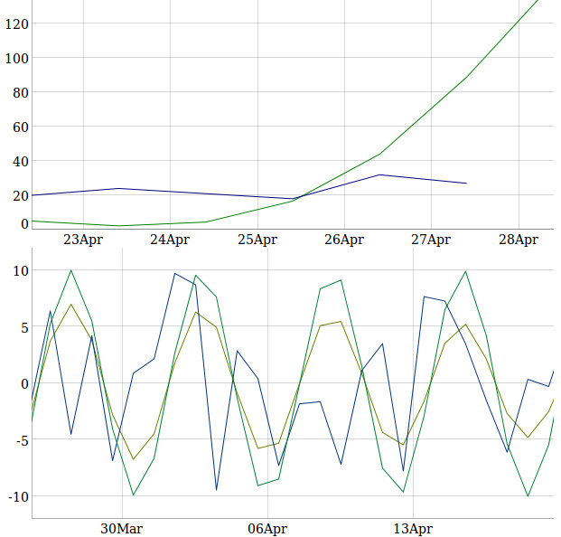

# SimpleMetric

Rails metric solution. Store data-points, display graphs. Based on dygraphs js lib.

[](http://badge.fury.io/rb/simple_metric)

## Example



## Usage

Add some data points:

```ruby
SimpleMetric::Metric.add_data_point "Users count", 30.days.ago, 10
SimpleMetric::Metric.add_data_point "Users count", 20.days.ago, 15
SimpleMetric::Metric.add_data_point "Users count", 10.days.ago, 25
```

Add many points

```ruby
SimpleMetric::Metric.add_data_points(
  [
    ["Users count", 30.days.ago, 10],
    ["Sales count", 10.days.ago, 1000]
  ]
)
```

Display graph into your erb template:

```ruby
<%= simple_metric_graph "Users count" %>
```

Plot multiple metrics:

```ruby
<%= simple_metric_graph "metric_1", "metric_2" %>
```

Add custom titles:

```ruby
<%= simple_metric_graph ["metric_1", "Title for metric 1"], ["metric_2", "Title 2"] %>
```

## Installation

Add this line to your application's Gemfile:

```txt
gem 'simple-metric'
```

And then execute:

```sh
$ bundle
```

Or install it yourself as:

```sh
$ gem install simple-metric
```

Add migration:

```sh
$ rails g migration create_metrics
```

Insert that:

```ruby
...

def change
    create_table :metrics do |t|
    t.string :key
    t.text :data_set

    t.timestamps
    end

    add_index :metrics, :key, :unique => true
end

...
```

Run migration:

```bash
$ rake db:migrate
```

Include dygraph js lib into your `application.js`:

```js
//= require dygraph-combined
```

## Contributing

1. Fork it ( https://github.com/sergio-fry/simple-metric/fork )
2. Create your feature branch (`git checkout -b my-new-feature`)
3. Commit your changes (`git commit -am 'Add some feature'`)
4. Push to the branch (`git push origin my-new-feature`)
5. Create a new Pull Request
